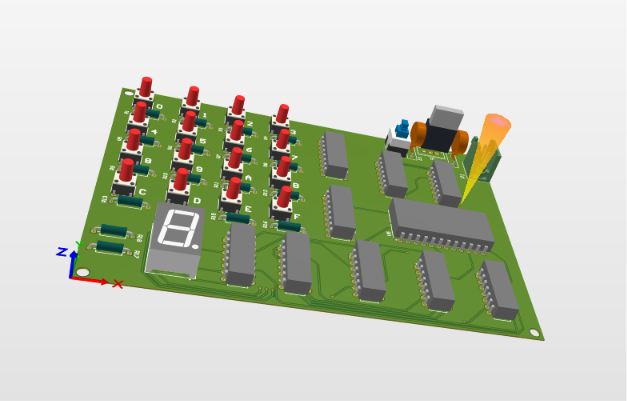
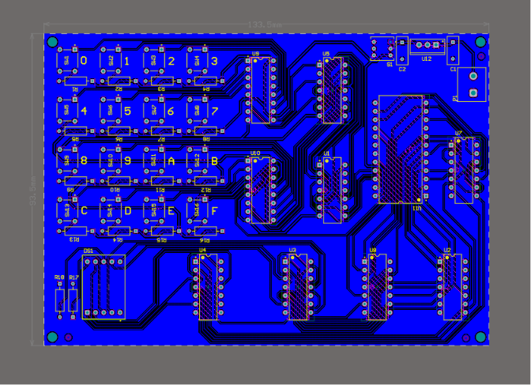
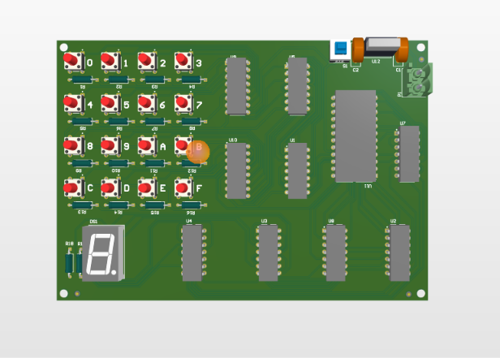
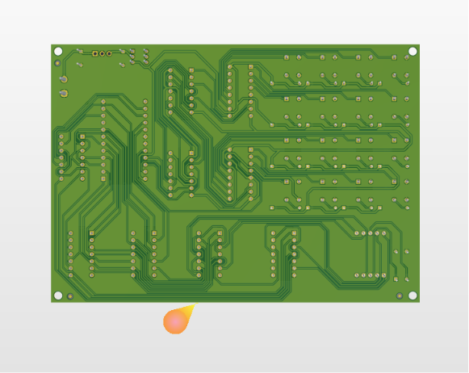
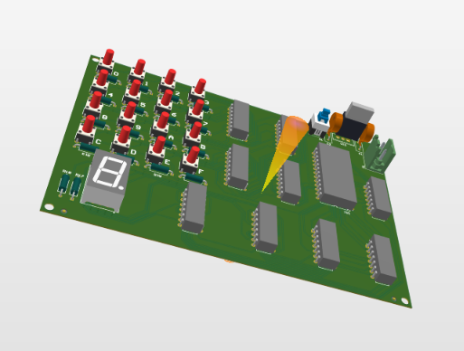
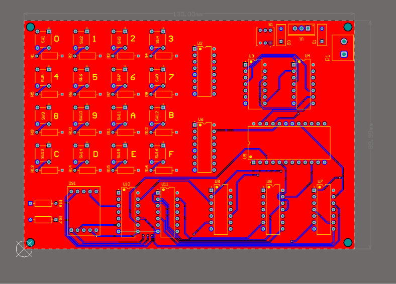
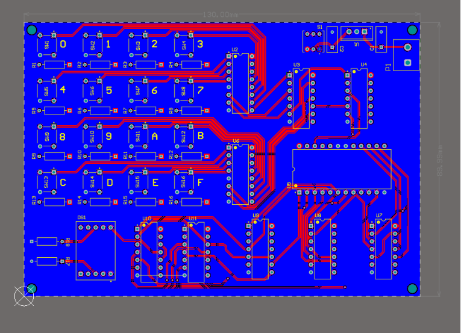
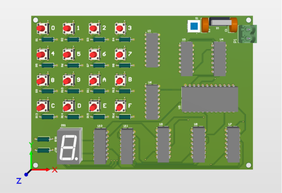
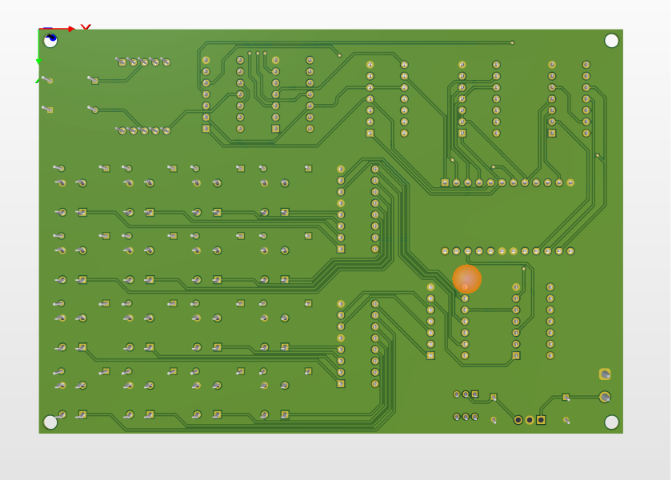

# Hexadecimal to 7-Segment Display using Digital Logic ICs



## Project Overview

This project implements a **Hexadecimal (0–F) to 7-Segment Display** using standard **74-series TTL logic ICs** without any microcontroller or programmable logic device.

The objective was not only to implement the logic but also to practice professional PCB design methodologies by creating:

- A hierarchical schematic with a single-layer PCB
- A conventional multi-sheet schematic with a two-layer PCB

The project demonstrates digital logic design, schematic organization, PCB routing, and hardware implementation.

---

## Design Objectives

- Display hexadecimal digits (0–F) on a common cathode 7-segment display
- Design the circuit using standard TTL logic ICs
- Practice hierarchical schematic design
- Compare single-layer and two-layer PCB routing
- Generate complete manufacturing documentation

---

## Features

- Supports hexadecimal inputs from **0 to F**
- 16 independent switch inputs
- Pure hardware implementation (No Microcontroller)
- Hierarchical schematic design
- Multi-sheet schematic design
- Single-layer PCB
- Two-layer PCB
- Manufacturing-ready PCB

---

## Design Flow

```
16 Switch Inputs
        │
        ▼
2 × SN74LS148
Priority Encoders
        │
        ▼
SN74HCU04
Hex Inverters
        │
        ▼
SN7432
OR Gates
        │
        ▼
SN74154
4-to-16 Decoder
        │
        ▼
Logic Optimization
using AND Gates
        │
        ▼
7-Segment Display
```

---

## Hardware Used

| Component | Quantity |
|-----------|----------|
| SN74LS148 Priority Encoder | 2 |
| SN74154 Decoder | 1 |
| SN74HCU04 Hex Inverter | 1 |
| SN7432 OR Gate | 1 |
| SN74S08 AND Gate | 3 |
| SN74LS11 Triple AND Gate | 2 |
| Common Cathode 7-Segment Display | 1 |
| Push Buttons | 16 |
| 1kΩ Resistors | 18 |
| L7805 Voltage Regulator | 1 |

---

## Schematic Design

### Version 1
- Hierarchical schematic
- Top sheet architecture
- Modular block design
- Single-layer PCB

Functional Blocks

- Power Supply
- Input Switch Module
- Encoder & Decoder Module
- Output Processing
- 7-Segment Driver

---

### Version 2

- Multi-sheet schematic
- Standard schematic design
- Two-layer PCB

---

## PCB Design

### Single Layer PCB

Features

- Routed completely on one copper layer
- Educational PCB routing practice
- Manual component placement
- Compact design

<h2>Single Layer PCB</h2>

<table>
<tr>
<td align="center">
<b>Top View</b><br>

</td>

<td align="center">
<b>Bottom View</b><br>

</td>
</tr>

<tr>
<td align="center">
<b>Front View</b><br>

</td>

<td align="center">
<b>Back View</b><br>

</td>
</tr>
</table>

<p align="center">
<b>Sectional View</b><br>

</p>

---

### Double Layer PCB

Features

- Improved routing
- Better signal organization
- Reduced jumper requirements
- Cleaner routing
- Professional PCB layout

<h2>Two Layer PCB</h2>

<table>
<tr>
<td align="center">
<b>Top View</b><br>

</td>

<td align="center">
<b>Bottom View</b><br>

</td>
</tr>

<tr>
<td align="center">
<b>Front View</b><br>

</td>

<td align="center">
<b>Back View</b><br>

</td>
</tr>
</table>

<p align="center">
<b>Sectional View</b><br>

</p>

---

## Software Used

- Altium Designer
- Draftsman
- Git
- GitHub

---

## Folder Structure

```
Hexadecimal_to_7Segment/

│── README.md
│── LICENSE (optional)

│
├── Docs
│   ├── Single_Layer_Schematic.pdf
│   ├── Two_Layer_Schematic.pdf
│   ├── Single_Layer_Draftsman.pdf
│   └── Two_Layer_Draftsman.pdf
│
├── Images
│   │
│   ├── Single_Layer
│   │   ├── Top_View.png
│   │   ├── Bottom_View.png
│   │   ├── Front_View.png
│   │   ├── Back_View.png
│   │   └── Sectional_View.png
│   │
│   └── Two_Layer
│       ├── Top_View.png
│       ├── Bottom_View.png
│       ├── Front_View.png
│       ├── Back_View.png
│       └── Sectional_View.png
│
├── Hardware
│   │
│   ├── Single_Layer
│   │   ├── Top.SchDoc
│   │   ├── Input_Switches.schDoc
│   │   ├── Encoder&Decoder.schDoc
│   │   ├── AND_operations.schDoc
│   │   ├── Seven_Segment_Driver.schDoc
│   │   ├── 7 segment 1.PrjPcb
│   │   ├── Single_Layer.PcbDoc
│   │   └── 7 segment 1.OutJob
│   │
│   ├── Double_Layer
│   │   ├── Power_Input.SchDoc
│   │   ├── Input_Switches.schDoc
│   │   ├── Encoder&Decoder.schDoc
│   │   ├── AND_operations.schDoc
│   │   ├── Seven_Segment_Driver.schDoc
│   │   ├── 7 segment 2.PrjPcb
│   │   ├── Double_Layer.PcbDoc
│   │   └── 7 segment 2.OutJob
│
├── Project_Outputs
    ├── Single_layer_Gerber.zip
    └── DOuble_layer_Gerber.zip

---

## Learning Outcomes

Through this project, I gained practical experience in:

- Digital Logic Design
- Boolean Logic Optimization
- Priority Encoder Design
- Decoder Design
- Hierarchical Schematic Design
- Multi-sheet Schematic Design
- PCB Routing
- Component Placement
- Design Rule Checking (DRC)
- Manufacturing File Generation

---

## Author

**Ram Kumar**

Electronics and Communication Engineering

Areas of Interest

- Embedded Systems
- Embedded Hardware Design
- PCB Design
- Digital Electronics
- Firmware Development

GitHub

https://github.com/ramkumar-2110

---